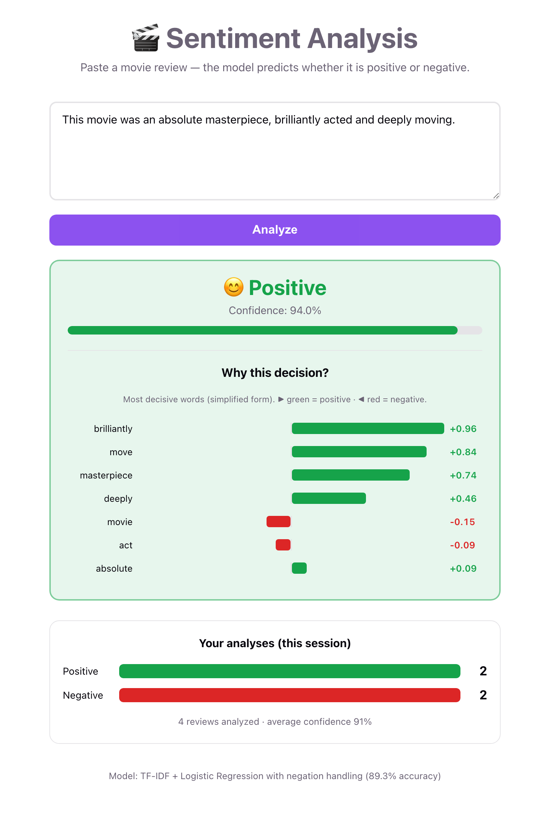
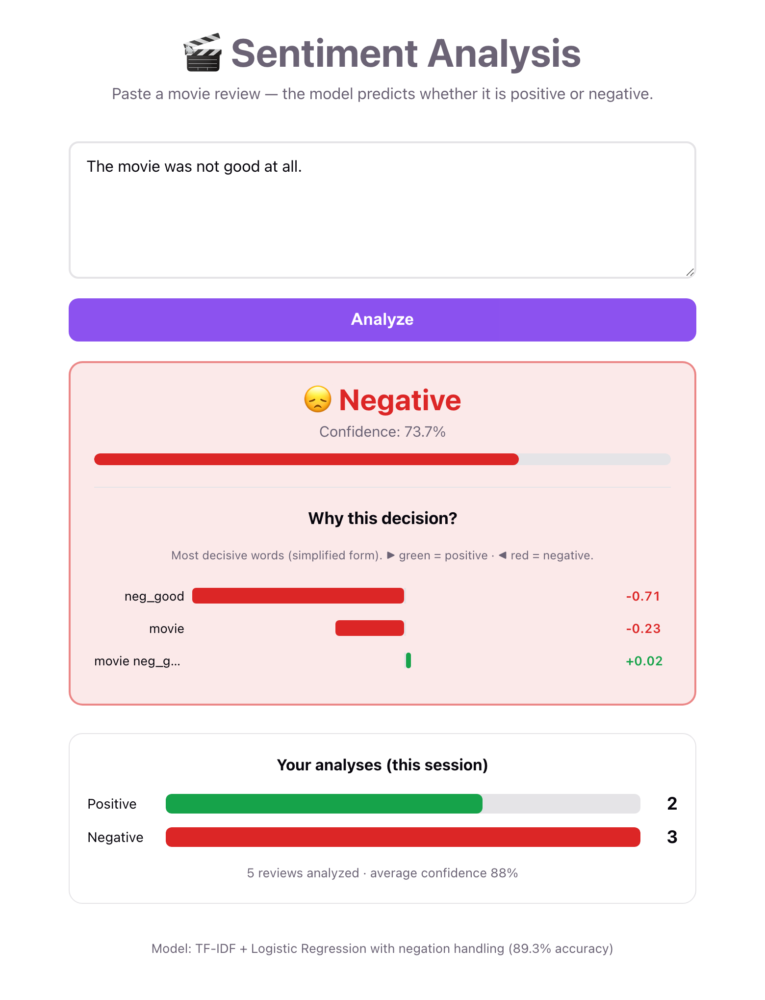

# Sentiment Analysis — NLP & Deep Learning

End-to-end sentiment classifier for movie reviews (IMDB, 50k reviews), built from raw
data all the way to a containerized web application. The project compares three
families of NLP models — a classical baseline, a recurrent neural network, and a
pretrained Transformer — and ships the best one behind a REST API and a React UI.

▶ Live : [sentiment-analysis-mt92.onrender.com](https://sentiment-analysis-mt92.onrender.com)

[](https://sentiment-analysis-mt92.onrender.com)


---

## Demo

The app predicts a sentiment and explains **why** — showing which words drove the
decision — plus a running session summary.

| Prediction & word contributions | Negation handling |
|:---:|:---:|
|  |  |
| A positive review with per-word contributions and the session histogram. | `"not good"` is correctly read as **negative** via the `neg_good` feature. |

---

##  Results

All models are evaluated on the same held-out test set (9,917 reviews).

| Model | Approach | Accuracy | Notes |
|-------|----------|----------|-------|
| **Logistic Regression + TF-IDF** ⭐ | Classical ML | **88.6 %** | Fast (0.1 s), interpretable, deployed |
| **+ Negation handling** | Classical ML | **89.3 %** | Final model — fixes "not good" cases |
| DistilBERT | Fine-tuned Transformer | 88.1 % | Pretrained, heavier, trained on a subset |
| LSTM | RNN from scratch | 84.6 % | Reads word order, but data-hungry |

**Key takeaway:** on this clean binary task, a well-tuned classical baseline matches
or beats far heavier deep-learning models — while remaining fast and fully
interpretable. The deployed model is the interpretable Logistic Regression.

---

## Features

- **Interpretable predictions** — the API returns *which words* drove each decision.
- **Negation-aware** — `"not good"` is correctly read as negative (`neg_good` feature).
- **REST API** (FastAPI) with automatic validation and interactive docs (`/docs`).
- **React frontend** with a live word-contribution chart and a session histogram.
- **Fully containerized** (Docker + Docker Compose) and covered by CI (GitHub Actions).

---

## Architecture

```
┌──────────────────────┐      HTTP/JSON      ┌───────────────────────────┐
│  React frontend       │  ───────────────▶  │  FastAPI (Uvicorn)         │
│  (nginx, port 8080)   │  ◀───────────────  │  TF-IDF + LogReg model     │
│  charts & UI          │   prediction +      │  (port 8000)               │
└──────────────────────┘   contributions     └───────────────────────────┘
                    orchestrated by docker-compose
```

**Inference pipeline (must match training exactly):**
```
raw text → negation-aware preprocessing (spaCy) → TF-IDF → Logistic Regression → sentiment
```

---

## 🛠️ Tech Stack

**ML / NLP:** Python, scikit-learn, spaCy, PyTorch, Hugging Face Transformers
**Backend:** FastAPI, Uvicorn, Pydantic
**Frontend:** React, Vite
**Infra:** Docker, Docker Compose, GitHub Actions (CI)

---

## Project Structure

```
src/
├── config/           Central configuration (paths, hyper-parameters)
├── preprocessing/    Text cleaning + NLP preprocessing (incl. negation)
├── features/         TF-IDF vectorizer
├── models/           Model builders (Logistic Regression, LSTM)
├── data/             PyTorch dataset utilities
├── inference/        predict_sentiment() — the production inference entry point
└── api/              FastAPI application
frontend/             React application (Vite)
notebooks/            Step-by-step training & analysis scripts (01 → 11)
models/               Trained artifacts (baseline models are versioned)
reports/              Evaluation figures & reports
```

---

##  Getting Started

### Option A — Docker (recommended)

```bash
docker compose up --build
```


### Option B — Local development

```bash
# 1. Backend
python -m venv venv && source venv/bin/activate
pip install -r requirements.txt
python -m spacy download en_core_web_sm
uvicorn src.api.main:app --reload          

# 2. Frontend (second terminal)
cd frontend && npm install && npm run dev   # http://localhost:5173
```

### Reproducing the models

The training scripts in `notebooks/` run each phase in order (EDA → cleaning →
preprocessing → features → training → evaluation). The baseline artifacts are
already versioned in `models/`, so the API runs without retraining.

---

## API Reference

**`POST /predict`**

```json
// Request
{ "text": "This movie was absolutely brilliant!" }

// Response
{
  "label": "positif",
  "proba_positif": 0.98,
  "confiance": 0.98,
  "contributions": [
    { "mot": "brilliant", "contribution": 2.29 },
    { "mot": "absolutely", "contribution": -0.56 }
  ]
}
```

Interactive documentation (Swagger UI) is available at **`/docs`**.
Health check: **`GET /health`**.

---

##  Methodology & Notes

- **No data leakage:** the TF-IDF vectorizer is fit on the training split only.
- **Class balance:** the dataset is 50/50, so accuracy is a reliable metric (AUC ≈ 0.96).
- **Negation handling:** words following a negation are prefixed with `neg_` until the
  next punctuation or contrastive conjunction (e.g. *but*), then the model is retrained.
- **Known limitation:** litotes such as *"not a bad film"* (double negation = positive)
  are still misclassified — a limit of feature-based models that an attention-based
  Transformer handles better.

---

##  License

MIT — see `LICENSE`.
