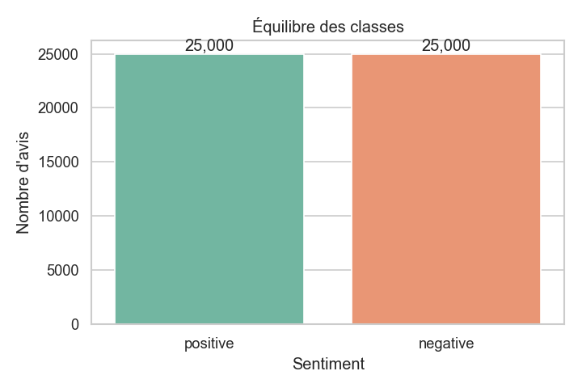
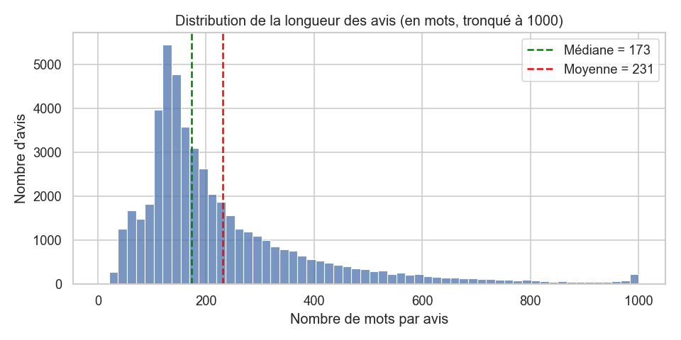

# Rapport EDA — Dataset IMDB (Phase 2)

## Vue d'ensemble
- **Observations** : 50,000 avis
- **Colonnes** : `review` (texte), `sentiment` (label)
- **Valeurs manquantes** : 0
- **Doublons** : 418 (0.84%) → à supprimer en Phase 3

## Équilibre des classes
sentiment
positive    25000
negative    25000

→ Dataset **équilibré (50/50)** : l'accuracy sera une métrique fiable.

## Longueur des textes (en mots)
count    50000.0
mean       231.2
std        171.3
min          4.0
25%        126.0
50%        173.0
75%        280.0
max       2470.0

→ Moyenne (231) > médiane (173) : distribution **asymétrique à droite**.
→ Impact : les avis très longs devront être **tronqués** pour BERT (max 512 tokens).

## Décisions pour la suite
1. Supprimer les 418 doublons (Phase 3).
2. Encoder les labels : positive → 1, negative → 0 (Phase 3).
3. Nettoyer le texte : HTML (` `), URLs, ponctuation, casse (Phase 3).
