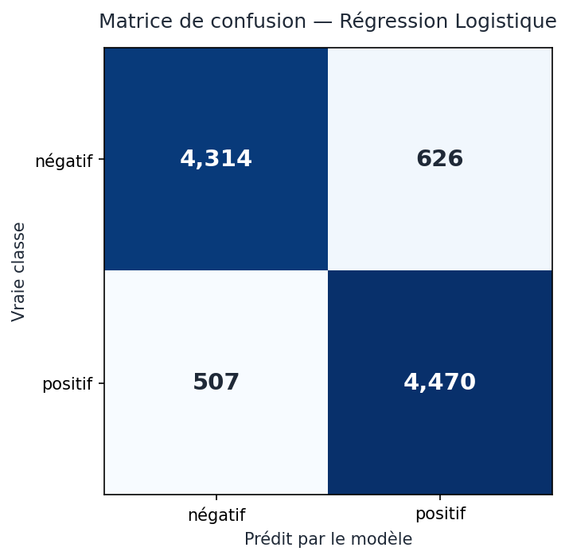
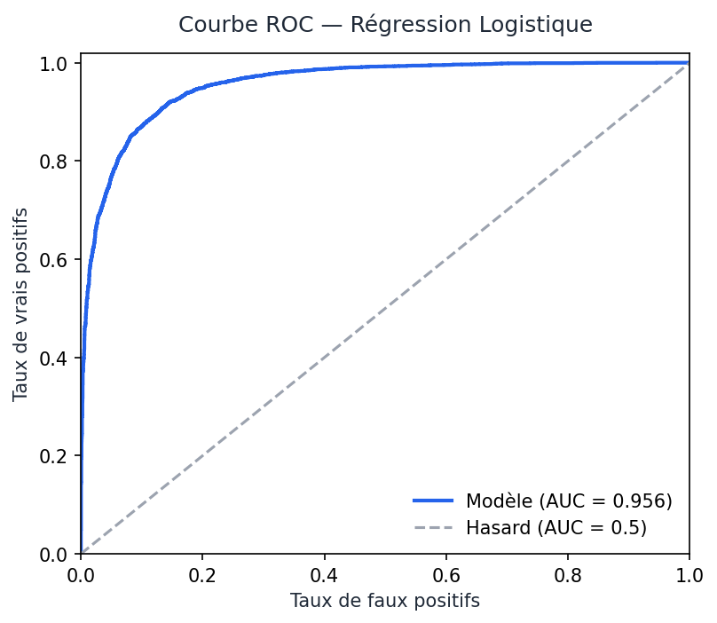

# Rapport d'évaluation — Baseline Régression Logistique (Phase 7)

Modèle : Régression Logistique sur vecteurs TF-IDF (5000 termes, mots + bigrammes).
Évalué sur le **test** (9 917 avis jamais vus à l'entraînement).

## Métriques globales
| Métrique | Valeur |
|---|---|
| Accuracy | 88,6 % |
| **AUC (ROC)** | **0,956** |
| F1 (macro) | 0,89 |

## Par classe
| Classe | Precision | Recall | F1 | Support |
|---|---|---|---|---|
| négatif (0) | 0,89 | 0,87 | 0,88 | 4 940 |
| positif (1) | 0,88 | 0,90 | 0,89 | 4 977 |

## Matrice de confusion
|  | Prédit négatif | Prédit positif |
|---|---|---|
| **Vrai négatif** | 4 314 (TN) | 626 (FP) |
| **Vrai positif** | 507 (FN) | 4 470 (TP) |

## Analyse des erreurs (1 133 / 9 917)
- **Faux positifs** : avis négatifs qui louent longuement avant un retournement critique.
- **Faux négatifs** : avis positifs contenant négations/nuances ("isn't exactly great, but...").

**Cause racine** : le TF-IDF **compte des mots** et ignore l'**ordre** et le **contexte**
(négation, sarcasme, retournement). → Motive le passage au Deep Learning (Phases 8-9),
qui lit la phrase dans l'ordre.
